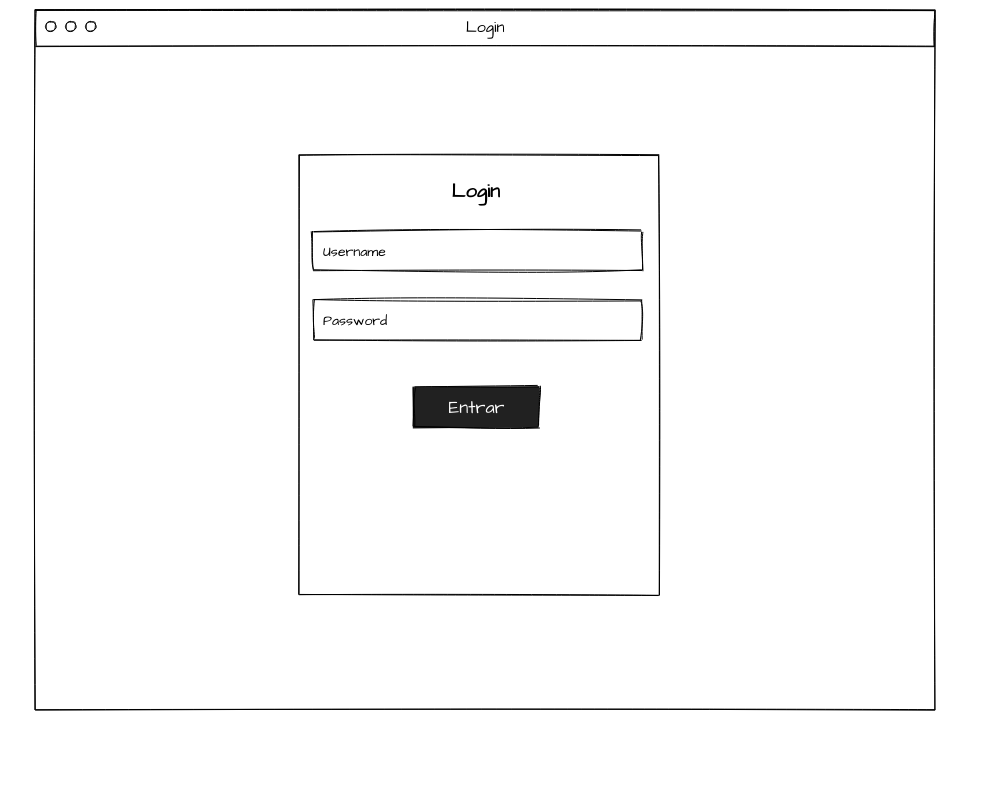
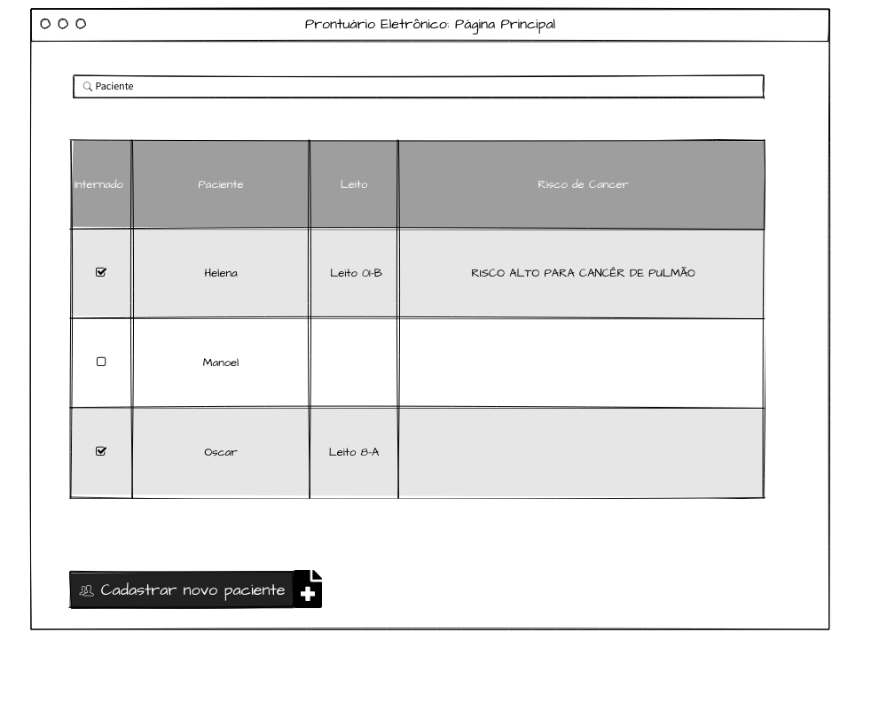
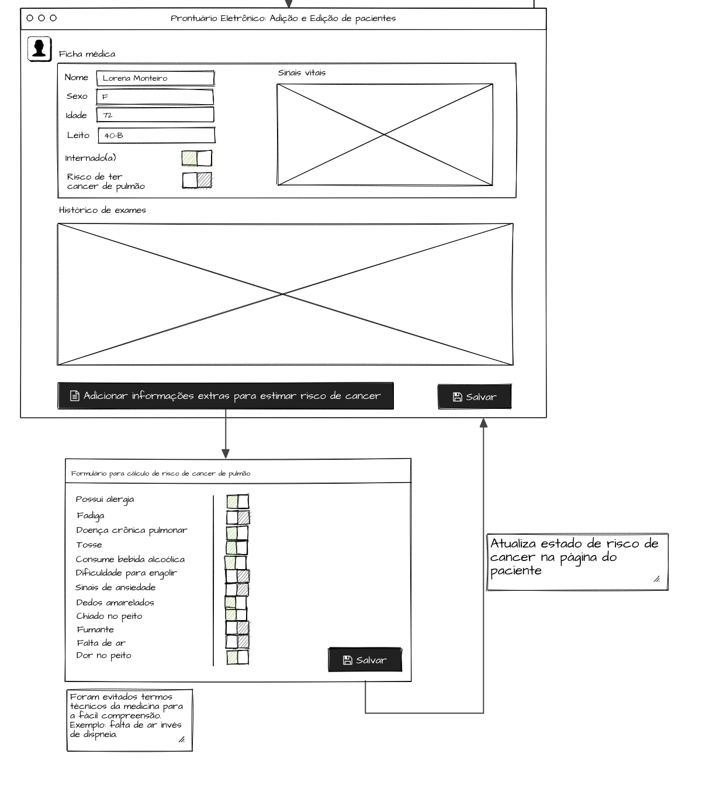

# Cancer Estimator Application

This application implements the following document designs of an Electronic Health Record System to help estimate the risk of patients having lung cancer.

# Technologies

- [FastAPI] is a library used to create the HTTP server.
- [HTMX] is used to handle front-end capabilities at the server-side.
- [SQLAlchemy] is used to manage SQL data persistence and query capabilities through ORM[^1].

[FastAPI]: https://fastapi.tiangolo.com/
[HTMX]: https://htmx.org/
[SQLAlchemy]: https://www.sqlalchemy.org/
[^1]: We use SQLite for simplicity, but PostgreSQL can be used in production.

# How to Run

Please ensure you have a Unix-like environment with [Python] and [Make] installed.

Use the following command to install the necessary libraries in a
python virtual environment managed by [pdm]:

```shell
make install
```

Use this command to run:

```shell
make run-local
```

If you have [Docker] installed and encounter problems running the system with the above commands, you can use this:

```shell
make run
```

How to run tests:

```
make check
```

[Python]: https://www.python.org/
[Make]: https://www.gnu.org/software/make/manual/make.html
[Docker]: https://www.docker.com/
[pdm]: https://pdm-project.org/

# Deployment via CI/CD

The software is automatically deployed as a Docker
container via GitHub Actions on the main branch, contingent upon the
successful completion of automated tests. The application is
self-hosted on an on-premises server located in Pará, Brazil, and is
accessible through the domain https://cancer.manoel.dev, utilizing
Cloudflare Tunnels for internet exposure.

# Manual deployment

If you have the proper credentials exported as environment variables:

- `CF_ACCESS_CLIENT_ID`
- `CF_ACCESS_CLIENT_SECRET`

You can deploy the application with:

```
make deploy
```

# Design

## Login Page



## Search Patient Page



## Add/Update Patient Page


